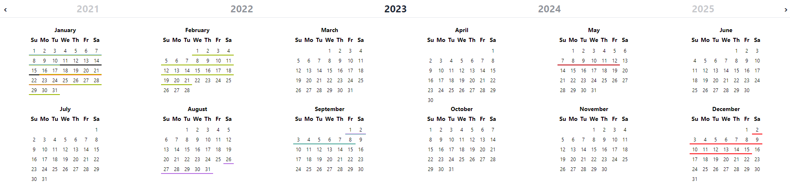

# jwf-year-calendar

A full react version of Paul-DS' js-year-calendar, https://github.com/year-calendar/js-year-calendar. Built with support from JWF Process Solutions Ltd.



## Installation
- From the Node package manager, using the following command: `npm install jwf-year-calendar` or `npm i jwf-year-calendar`
- From Yarn, using the following command: `yarn add jwf-year-calendar`

## Usage

The calendar can be created using the following javascript code :
```
import Calendar from 'jwf-year-calendar';

render() {
    return (<Calendar />);
}
```

## Using options

You can specify props to customize the calendar for your needs:
```
render() {
    return (
        <Calendar enableRangeSelection={true} weekStart={0}/>
    );
}
```
The props are as follows

| Option name | Description | Type | Default value |
| ----------- | ----------- | ---- | ------------- |
| contextMenuItems | Specifies the items of the default context menu. This returns a callback function | array | `[]` |
| dataSource | The elements that must be displayed on the calendar. | array or function | `[]` |
| disabledDays | The days that must be displayed as disabled. | array | `[]` |
| enableRangeSelection | Specifies whether the range selection is enabled. | boolean | `false` |
| weekStart | The starting day of the week. This option overrides the parameter define in the language file. | number | `0` |
| darkMode | Allows user to select if they want the contextmenu and day tile to display in dark mode or not | boolean | 'false' | 

| Event name | Description | Parameter |
| ---------- | ----------- | --------- |
| onRangeSelected | Function fired when a date range is selected. | `{ startDate, endDate }` |
| onYearChange | Function fired when the visible year of the calendar is changed. | `{ currentYear }` |